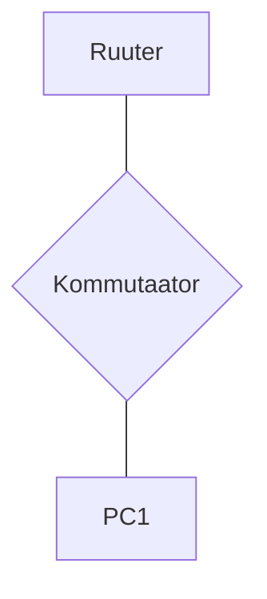

# DHCP ja alamvõrkude labor

## Seadmed
- Arvuti x1
- Cisco 2960 kommutaator x1
- Cisco 1941 ruuter x1

## Topoloogia


## Nõuded

**Võrk:** Jaga 192.168.x.0/24 neljaks alamvõrguks

**VLANid:** Kasuta VLAN 10, 20, 30, 40 iga alamvõrgu jaoks

**Kommutaatori port-ide jaotus:**
- Port 1-5: VLAN 10 (PC1 testimiseks)
- Port 6-10: VLAN 20 
- Port 11-15: VLAN 30
- Port 16-20: VLAN 40
- Port 24: Trunk (ruuterisse)

**DHCP ruuteri seadistus:**
- Pool 1: Aadressid .6 kuni .30
- Pool 2: Aadressid .6 kuni .20
- Pool 3: Aadressid .6 kuni .25
- Pool 4: Ainult staatilised
- Välista esimesed 5 aadressi alamvõrgust
- Anna DNS ja gateway automaatselt

**Ruutimine:** VLAN-ide vaheline Router-on-a-Stick meetodil

## Dokumentatsiooni tabelid

### Alamvõrkude plaan
| Võrk | Mask | Gateway | VLAN | Kasutatavad hostid |
|------|------|---------|------|--------------------|
| | | | | |
| | | | | |
| | | | | |
| | | | | |

### DHCP pool-id
| Pool | Võrk | Vahemik | Välistatud | DNS |
|------|------|---------|------------|-----|
| | | | | |
| | | | | |
| | | | | |
| | | | | |

### Seadmete aadressid
| Seade | IP | Alamvõrk | VLAN | Tüüp |
|-------|----|-----------|----- |------|
| | | | | |
| | | | | |
| | | | | |
| | | | | |

## Testimise kriteeriumid
- PC1 saab õige DHCP aadressi erinevates VLAN-ides
- VLAN-ide vaheline ping töötab
- Erinevad DHCP pool-id seadistatud ruuteril
- PC1 saab liigutada erinevate VLAN-ide vahel testimiseks

## Vihjed 🐵

## 1. ETAPP: Planeerimine ja arvutused

### Alamvõrkude arvutamine
1. **Arvuta välja 4 alamvõrku 192.168.x.0/24-st**
   - Mitu bitti vaja? 4 alamvõrku = ?
   - Mis on uus subnet mask?
   - Millised on alamvõrkude aadressid?

2. **Täida alamvõrkude tabel**

### Dokumentatsiooni lingid:
- [Subnetting kalkulaator](https://www.calculator.net/ip-subnet-calculator.html)
- [VLSM Tutorial](https://www.cisco.com/c/en/us/support/docs/ip/routing-information-protocol-rip/13788-3.html)

---

## 2. ETAPP: Kommutaatori seadistamine

### VLAN-ide loomine
```
Switch> enable
Switch# configure terminal
Switch(config)# vlan xx
Switch(config-vlan)# name VLAN_xxx
Switch(config-vlan)# exit
```

### Port-ide määramine VLAN-idesse
```
Switch(config)# interface range fastethernet xxxxx
Switch(config-if-range)# switchport mode access
Switch(config-if-range)# switchport access vlan xxxx
```

### Trunk pordi seadistamine
```
Switch(config)# interface gigabitethernet xxxx
Switch(config-if)# switchport mode trunk
Switch(config-if)# switchport trunk allowed vlan xxxxxx
```

### Dokumentatsiooni lingid:
- [VLAN Configuration Guide](https://www.cisco.com/c/en/us/td/docs/switches/lan/catalyst2960/software/release/12-2_55_se/configuration/guide/scg_2960/swvlan.html)

---

## 3. ETAPP: Router-on-a-Stick seadistamine

### Subinterface-ide loomine
```
Router> enable
Router# configure terminal
Router(config)# interface gigabitethernet xxxx
Router(config-if)# no shutdown
Router(config-if)# exit

Router(config)# interface gigabitethernet xxxx
Router(config-subif)# encapsulation dot1Q xxxx
Router(config-subif)# ip address 192.168.x.1 255.255.255.???
```

### Korda kõigi VLAN-ide jaoks (10, 20, 30, 40)

### Dokumentatsiooni lingid:
- [Router-on-a-Stick Configuration](https://www.cisco.com/c/en/us/support/docs/lan-switching/inter-vlan-routing/41860-howto-L3-intervlanrouting.html)

---

## 4. ETAPP: DHCP seadistamine ruuteril

### DHCP pool-ide loomine
```
Router(config)# ip dhcp pool VLAN10
Router(dhcp-config)# network 192.168.x.0 255.255.255.???
Router(dhcp-config)# default-router 192.168.x.1
Router(dhcp-config)# dns-server 8.8.8.8
Router(dhcp-config)# exit
```

### Aadresside välistamine
```
Router(config)# ip dhcp excluded-address 192.168.x.1 192.168.x.5
```

### Dokumentatsiooni lingid:
- [Cisco Router DHCP Configuration](https://www.cisco.com/c/en/us/td/docs/ios-xml/ios/ipaddr_dhcp/configuration/xe-3s/dhcp-xe-3s-book/config-dhcp-server.html)

---

## 5. ETAPP: Testimine

### PC1 testimine
1. **Lülita PC1 VLAN 10 porti**
   - `ipconfig /release`
   - `ipconfig /renew`
   - Kontrolli saadud IP-d

2. **Lülita PC1 teistesse VLAN-idesse**
   - Muuda port access VLAN-i
   - Tee uuesti DHCP request

3. **Ping testimine**
   - Gateway ping
   - Teiste alamvõrkude ping

### Dokumentatsiooni lingid:
- [DHCP Troubleshooting](https://www.cisco.com/c/en/us/support/docs/ip/dynamic-host-configuration-protocol-dhcp/27470-100.html)

---

## Dokumenteerimine

### Mida dokumenteerida:
1. **Täidetud tabelid**
2. **Seadistuste backup-id**
3. **Testimise tulemused**
4. **Võrgu diagramm täpsete IP-dega**

### Show käsud dokumenteerimiseks:
```
show vlan brief
show ip dhcp binding
show ip dhcp pool
show ip route
show running-config
```

---

## Vihjed 🐵

**Probleemid?**
- Kas trunk port töötab? `show interfaces trunk`
- Kas DHCP pool on õige? `show ip dhcp pool`
- Kas ruutimine töötab? `show ip route`

**Kasulikud käsud:**
- `debug ip dhcp server packet` - DHCP debug
- `show ip dhcp conflict` - IP konfliktid
- `clear ip dhcp binding *` - DHCP lease-ide kustutamine
