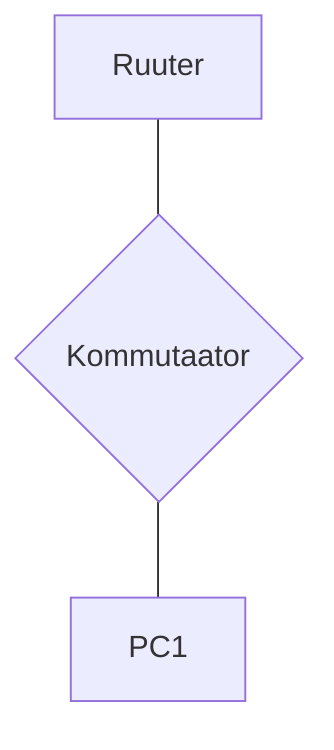

# DHCP ja alamvõrkude labor

## Seadmed
- Arvuti x1
- Cisco 2960 kommutaator x1
- Cisco 1941 ruuter x1

## Topoloogia


## Nõuded

**Võrk:** Jaga 192.168.x.0/24 neljaks alamvõrguks

**VLANid:** Kasuta VLAN 10, 20, 30, 40 iga alamvõrgu jaoks

**Kommutaatori port-ide jaotus:**
- Port 1-5: VLAN 10 (PC1 testimiseks)
- Port 6-10: VLAN 20 
- Port 11-15: VLAN 30
- Port 16-20: VLAN 40
- Port 24: Trunk (ruuterisse)

**DHCP ruuteri seadistus:**
- Pool 1: Aadressid .6 kuni .30
- Pool 2: Aadressid .6 kuni .20
- Pool 3: Aadressid .6 kuni .25
- Pool 4: Ainult staatilised
- Välista esimesed 5 aadressi alamvõrgust
- Anna DNS ja gateway automaatselt

**Ruutimine:** VLAN-ide vaheline Router-on-a-Stick meetodil

## Dokumentatsiooni tabelid

### Alamvõrkude plaan
| Võrk | Mask | Gateway | VLAN | Kasutatavad hostid |
|------|------|---------|------|--------------------|
| | | | | |
| | | | | |
| | | | | |
| | | | | |

### DHCP pool-id
| Pool | Võrk | Vahemik | Välistatud | DNS |
|------|------|---------|------------|-----|
| | | | | |
| | | | | |
| | | | | |
| | | | | |

### Seadmete aadressid
| Seade | IP | Alamvõrk | VLAN | Tüüp |
|-------|----|-----------|----- |------|
| | | | | |
| | | | | |
| | | | | |
| | | | | |

## Testimise kriteeriumid
- PC1 saab õige DHCP aadressi erinevates VLAN-ides
- VLAN-ide vaheline ping töötab
- Erinevad DHCP pool-id seadistatud ruuteril
- PC1 saab liigutada erinevate VLAN-ide vahel testimiseks

## Vihjed 🐵
**Jännis?** Otsi: "Router DHCP pool", "Router-on-a-Stick"

**Pea meeles:** 
- DHCP pool-id seadistatakse ruuteril endal
- Subinterface igale VLAN-ile
- Trunk port peab lubama kõik VLAN-id

**Ruuteri näide:**
```
Router(config)# ip dhcp pool VLAN10
Router(dhcp-config)# network 192.168.x.0 255.255.255.???
Router(dhcp-config)# default-router 192.168.x.?
Router(dhcp-config)# dns-server 8.8.8.8
```
