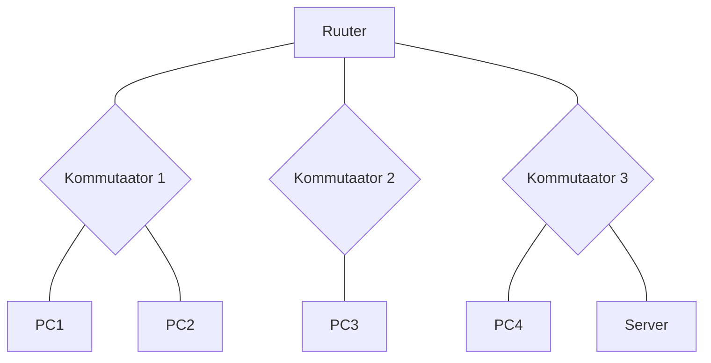

# DHCP ja alamvõrkude labor

## Seadmed
- Arvuti x4
- Cisco 2960 kommutaator x3
- Cisco 1941 ruuter x1
- Server x1

## Topoloogia

## Nõuded

**Võrk:** Jaga 192.168.x.0/24 neljaks alamvõrguks

**VLANid:** Kasuta VLAN 10, 20, 30, 40 iga alamvõrgu jaoks

**DHCP serveri seadistus:**
- Pool 1: Aadressid .6 kuni .30
- Pool 2: Aadressid .6 kuni .20
- Pool 3: Aadressid .6 kuni .25
- Pool 4: Ainult staatilised
- Välista esimesed 5 aadressi alamvõrgust
- Anna DNS ja gateway automaatselt

**Ruutimine:** VLAN-ide vaheline Router-on-a-Stick meetodil

## Dokumentatsiooni tabelid

### Alamvõrkude plaan
| Võrk | Mask | Gateway | VLAN | Kasutatavad hostid |
|------|------|---------|------|--------------------|
| | | | | |

### DHCP pool-id
| Pool | Võrk | Vahemik | Välistatud | DNS |
|------|------|---------|------------|-----|
| | | | | |

### Seadmete aadressid
| Seade | IP | Alamvõrk | VLAN | Tüüp |
|-------|----|-----------|----- |------|
| | | | | |

## Testimise kriteeriumid
- Kõik arvutid saavad õiged DHCP aadressid
- VLAN-ide vaheline ping töötab
- Erinevad DHCP pool-id nähtavad lease'ides
- Server kättesaadav kõigist VLAN-idest

## Vihjed 🐵

**Jännis?** Otsi: "DHCP relay", "Router-on-a-Stick"

**Pea meeles:**  Trikk:
ip helper-address on VÕTI! See forward'ib DHCP broadcasti serverile läbi ruuteri.