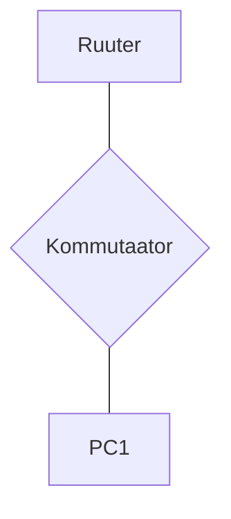

# DHCP ja VLSM Labor

## ⚠️ OLULINE
**Kasutage eelmise nädala juhendit**

Sealt leiate kõik vajalikud käsud. Selles laboris muutuvad ainult:
- Võrgu aadressid (172.16.x.0/23 asemel 192.168.x.0/24)
- Alamvõrkude suurused (VLSM!)
- IP arvutused

## Seadmed
- Arvuti x1
- Cisco kommutaator x1
- Cisco ruuter x1

## Topoloogia


## Nõuded

**Võrk:** Jaga 172.16.x.0/23 neljaks **ERINEVA SUURUSEGA** alamvõrguks
- x = sinu number * 2 (vaata tabelist)
- Näide: Suslik (9) kasutab 172.16.18.0/23

**VLANid ja nende vajadused:**
- VLAN 10: Vajab 200 hosti (Peakontor)
- VLAN 20: Vajab 100 hosti (Tootmine)  
- VLAN 30: Vajab 50 hosti (Müügiosakond)
- VLAN 40: Vajab 25 hosti (IT-osakond)

**Kommutaatori port-ide jaotus:**
- Port 1-8: VLAN 10
- Port 9-14: VLAN 20 
- Port 15-19: VLAN 30
- Port 20-23: VLAN 40
- Port 24: Trunk (ruuterisse)

**DHCP ruuteri seadistus:**
- Pool 1 (VLAN10): Aadressid .10 kuni .200
- Pool 2 (VLAN20): Aadressid .10 kuni .100
- Pool 3 (VLAN30): Aadressid .133 kuni .173
- Pool 4 (VLAN40): Aadressid .197 kuni .212
- Välista gateway ja esimesed 4 aadressi igast võrgust
- DNS: 1.1.1.1 (primaarne) ja 8.8.8.8 (sekundaarne)

**Ruutimine:** Router-on-a-Stick + Inter-VLAN routing

## Dokumentatsiooni tabelid

### VLSM Planeerimine [VLSM Calculator](https://www.site24x7.com/tools/ipv4-subnetcalculator.html)
| VLAN | Vajab hosti | Vaja aadresse (koos võrgu ja broadcast) | Subnet bits | Subnet Mask | Võrgu aadress | Broadcast | Gateway |
|------|-------------|------------------------------------------|-------------|-------------|---------------|-----------|---------|
| 10 | 200 | 256 (2^8) | /24 | | | | |
| 20 | 100 | 128 (2^7) |  | | | | |
| 30 | 50 | 64 (2^6) |  | | | | |
| 40 | 25 | 32 (2^5) |  | | | | |

### DHCP pool-id
| Pool nimi | VLAN | Võrk | Subnet Mask | Vahemik | Excluded | Gateway | DNS |
|-----------|------|------|-------------|---------|----------|---------|-----|
| PEAKONTOR | 10 | | | | | | |
| TOOTMINE | 20 | | | | | | |
| MUUK | 30 | | | | | | |
| IT | 40 | | | | | | |

### Seadmete füüsiline aadressimine (Palun Vaata üle, mis interface on tegelikult su masinates)
| Seade | Interface | IP aadress | Subnet Mask | VLAN | Kirjeldus |
|-------|-----------|------------|-------------|------|-----------|
| R1 | G0/0 | - | - | - | Füüsiline |
| R1 | G0/0.10 | | | 10 | Peakontor |
| R1 | G0/0.20 | | | 20 | Tootmine |
| R1 | G0/0.30 | | | 30 | Müük |
| R1 | G0/0.40 | | | 40 | IT |
| SW1 | VLAN1 | | 255.255.255.0 | 1 | Management |
| PC1 | NIC | DHCP | Auto | Muutuv | Test |

## VLSM Arvutamise vihjed

### Algne võrk analüüs:
- /23 = ? aadressi kokku
- Mask: 255.255.???.0
- Mitu /24 võrku mahub /23 sisse?

### Samm 1: Sorteeri vajadused (suuremast väiksemani)
- Miks on oluline alustada suurimast?
- Kui palju aadresse tegelikult vaja (2^x)?

### Samm 2: Määra võrgud järjest
- Esimene võrk algab kust?
- Järgmine võrk algab kohe pärast eelmise broadcast aadressi

## Konfiguratsioon

**Kasutage eelmise nädala juhendi käske!**

Vaadake eelmisest labist:
- Kuidas luua VLAN-e
- Kuidas seadistada trunk porti
- Kuidas luua subinterface'e
- Kuidas seadistada DHCP pool-e

**Muutke ainult:**
- IP aadressid vastavalt teie VLSM arvutustele
- Subnet mask'id vastavalt alamvõrgu suurusele
- DHCP vahemikud vastavalt nõuetele

## Testimine

### 1. DHCP test
```
PC> ipconfig /release
PC> ipconfig /renew
PC> ipconfig /all
```

### 2. Connectivity test
```
PC> ping [gateway]
PC> ping [teise VLANi IP]
PC> ping 1.1.1.1
```

### 3. Kontrolli ruuteril
```
Router# show ip dhcp binding
Router# show ip dhcp pool
Router# show ip dhcp conflict
Router# show ip route
Router# show ip interface brief
```

### 4. Kontrolli kommutaatoril
```
Switch# show vlan brief
Switch# show interfaces trunk
Switch# show interfaces status
```

## Lisaülesanded (boonuspunktid)

### 1. DHCP Options (5 punkti)
- Lisa DHCP option 150 (TFTP server)
- Lisa domain-name "labor.local"
- Seadista lease time 1 päev

### 2. Access Control List (10 punkti)
```
! IT osakond (VLAN40) saab kõikidesse võrkudesse
! Tootmine (VLAN20) ei saa Peakontorisse (VLAN10)
! Kõik saavad internetti (ping 8.8.8.8)
```

### 3. VLAN Security (5 punkti)
- Port security - max 2 MAC aadressi
- DHCP snooping VLAN 10,20,30,40
- Storm control broadcast level 50%

### 4. Dokumenteeri võrgu jõudlus (5 punkti)
- Mõõda ping latency VLAN-ide vahel
- Testi DHCP lease time
- Bandwidth test erinevate VLAN-ide vahel

## Hindamine
- VLSM õiged arvutused (30%)
- Töötav konfiguratsioon (35%)
- Täielik dokumentatsioon (25%)
- Lisaülesanded (10%)

## Vihjed 🐵
- Alusta VLSM arvutustest paberil!
- /23 = 512 aadressi = 2 x /24 võrku
- Suurim alamvõrk võtab terve /24
- Ülejäänud 256 aadressi jaga 3-ks
- Ära unusta: Network ja Broadcast aadresse ei saa kasutada!
- Gateway on tavaliselt esimene kasutatav aadress

## Abi lingid
- [VLSM Calculator](https://www.site24x7.com/tools/ipv4-subnetcalculator.html)
- [Cisco DHCP Guide](https://www.cisco.com/c/en/us/td/docs/ios-xml/ios/ipaddr_dhcp/configuration/xe-3s/dhcp-xe-3s-book.html)
- [Router-on-a-Stick](https://networklessons.com/ip-routing/how-to-configure-router-on-a-stick)
