## Mis on DHCP ja miks me seda vajame?

### DHCP põhimõte
DHCP (Dynamic Host Configuration Protocol) on protokoll, mis automaatselt jagab IP aadresse ja teisi võrgu seadeid arvutitele.

```mermaid
graph LR
    A[Arvuti] -->|"Palun IP aadressi!"| B[DHCP Server]
    B -->|"Võta 192.168.1.100"| A
    A -->|"Aitäh! Kasutan seda"| B
```



**Miks see vajalik:**
- Ilma DHCP-ta peaks iga seadme käsitsi seadistama
- Hoiab ära IP aadresside konflikte
- Annab automaatselt ka DNS ja gateway seaded

### DORA protsess - kuidas DHCP töötab

```mermaid
sequenceDiagram
    participant C as Klient
    participant S as DHCP Server
    
    C->>S: DISCOVER (broadcast)
    Note over C,S: "Kas keegi annab mulle IP?"
    
    S->>C: OFFER
    Note over C,S: "Võta 192.168.1.50"
    
    C->>S: REQUEST
    Note over C,S: "Okei, võtan selle"
    
    S->>C: ACK
    Note over C,S: "Kinnitatud! Kasuta 24h"
```



---

## Labori ülesanne

### Seadmed ja topoloogia


**Seadmed:**
- 1x Cisco 1941 ruuter (DHCP server)
- 1x Cisco 2960 kommutaator 
- 1x arvuti (testimiseks)

### Ülesande eesmärk

**Luua 4 alamvõrku ja DHCP pool-i:**
- Jagada 192.168.x.0/24 → 4 alamvõrku
- Seadistada Router-on-a-Stick
- Konfigureerida DHCP ruuteril
- Testida erinevates VLAN-ides

---

## Samm 1: Alamvõrkude planeerimine

### Arvutage välja alamvõrgud

**Ülesanne:** Jagada 192.168.x.0/24 neljaks võrdseks alamvõrguks

**Mõtlemisprotsess:**
1. Palju bitte vaja? 4 alamvõrku = 2² = 2 bitti
2. Uus mask: /24 + 2 = /26
3. Subnet mask: 255.255.255.192

**Täida tabel:**

| Alamvõrk | Võrgu aadress | Mask | Gateway | VLAN | Host vahemik |
|-----------|---------------|------|---------|------|--------------|
| 1 | | /26 | | 10 | |
| 2 | | /26 | | 20 | |  
| 3 | | /26 | | 30 | |
| 4 | | /26 | | 40 | |

---

## Samm 2: Kommutaatori konfigureerimine

### VLAN-ide loomine

**Miks me seda teeme:**
- Jagame ühe füüsilise kommutaatori 4 loogiliseks võrguks
- Iga VLAN = eraldi alamvõrk
- PC1 saame testida erinevates VLAN-ides

```cisco
Switch> enable
Switch# configure terminal
Switch(config)# vlan 10
Switch(config-vlan)# name VLAN_10
Switch(config-vlan)# exit

Switch(config)# vlan 20  
Switch(config-vlan)# name VLAN_20
Switch(config-vlan)# exit

Switch(config)# vlan 30
Switch(config-vlan)# name VLAN_30  
Switch(config-vlan)# exit

Switch(config)# vlan 40
Switch(config-vlan)# name VLAN_40
Switch(config-vlan)# exit
```

### Port-ide määramine VLAN-idesse

**Mõtlemisprotsess:**
- Port 1-5 → VLAN 10 (PC1 testimiseks)
- Port 6-10 → VLAN 20
- Port 11-15 → VLAN 30  
- Port 16-20 → VLAN 40

```cisco
Switch(config)# interface range fastethernet 0/1-5
Switch(config-if-range)# switchport mode access
Switch(config-if-range)# switchport access vlan 10
Switch(config-if-range)# exit

Switch(config)# interface range fastethernet 0/6-10
Switch(config-if-range)# switchport mode access
Switch(config-if-range)# switchport access vlan 20
Switch(config-if-range)# exit

Switch(config)# interface range fastethernet 0/11-15
Switch(config-if-range)# switchport mode access
Switch(config-if-range)# switchport access vlan 30
Switch(config-if-range)# exit

Switch(config)# interface range fastethernet 0/16-20
Switch(config-if-range)# switchport mode access
Switch(config-if-range)# switchport access vlan 40
Switch(config-if-range)# exit
```

### Trunk pordi seadistamine

**Miks trunk port:**
- Üks kaabel ruuteri ja kommutaatori vahel
- Peab kandma kõiki 4 VLAN-i liiklust
- VLAN tag-id eristavad liiklust


```cisco
Switch(config)# interface gigabitethernet 0/1
Switch(config-if)# switchport mode trunk
Switch(config-if)# switchport trunk allowed vlan 10,20,30,40
Switch(config-if)# exit
```

---

## Samm 3: Router-on-a-Stick seadistamine

### Miks Router-on-a-Stick?

```mermaid
graph TD
    R1[Ruuter<br/>Füüsiline interface G0/0] 
    R1 --- R2[G0/0.10<br/>Gateway VLAN 10]
    R1 --- R3[G0/0.20<br/>Gateway VLAN 20]  
    R1 --- R4[G0/0.30<br/>Gateway VLAN 30]
    R1 --- R5[G0/0.40<br/>Gateway VLAN 40]
    
    style R1 fill:#e1f5fe
    style R2 fill:#ffebee
    style R3 fill:#fff3e0
    style R4 fill:#e8f5e8
    style R5 fill:#f3e5f5
```



**Põhimõte:**
- Üks füüsiline port ruuteril
- 4 virtuaalset subinterface-i
- Iga subinterface = ühe VLAN-i gateway

### Füüsilise interface-i aktiveerimine

```cisco
Router> enable
Router# configure terminal
Router(config)# interface gigabitethernet 0/0
Router(config-if)# no shutdown
Router(config-if)# exit
```

### Subinterface-ide loomine

**VLAN 10 subinterface:**

```cisco
Router(config)# interface gigabitethernet 0/0.10
Router(config-subif)# encapsulation dot1Q 10
Router(config-subif)# ip address 192.168.x.1 255.255.255.192
Router(config-subif)# exit
```

**Mõtlemisprotsess:**
- `g0/0.10` = subinterface number 10 (vastab VLAN 10-le)
- `encapsulation dot1Q 10` = ütleb "see interface töötleb VLAN 10 tag-e"
- `ip address` = see IP saab VLAN 10 gateway-ks

**VLAN 20 subinterface:**

```cisco
Router(config)# interface gigabitethernet 0/0.20
Router(config-subif)# encapsulation dot1Q 20
Router(config-subif)# ip address 192.168.x.65 255.255.255.192
Router(config-subif)# exit
```

**VLAN 30 subinterface:**

```cisco
Router(config)# interface gigabitethernet 0/0.30
Router(config-subif)# encapsulation dot1Q 30
Router(config-subif)# ip address 192.168.x.129 255.255.255.192
Router(config-subif)# exit
```

**VLAN 40 subinterface:**

```cisco
Router(config)# interface gigabitethernet 0/0.40
Router(config-subif)# encapsulation dot1Q 40
Router(config-subif)# ip address 192.168.x.193 255.255.255.192
Router(config-subif)# exit
```

---

## Samm 4: DHCP konfigureerimine

### DHCP töötamise loogika

```mermaid
graph TD
    A[PC1 VLAN 10-s] -->|DHCP Request| B[Switch]
    B -->|VLAN 10 tag| C[Ruuter G0/0.10]
    C -->|Vaatab: milline alamvõrk?| D[Pool VLAN10]
    D -->|Annab IP sellest pool-ist| C
    C -->|DHCP Reply| B
    B -->|Tagasi PC1-le| A
```



### Excluded aadresside seadistamine

**Miks exclude:**
- Gateway IP-d ei tohi DHCP jagada
- Serverite jaoks reserveeritud aadressid
- Vältida konflikte

```cisco
Router(config)# ip dhcp excluded-address 192.168.x.1 192.168.x.5
Router(config)# ip dhcp excluded-address 192.168.x.65 192.168.x.69  
Router(config)# ip dhcp excluded-address 192.168.x.129 192.168.x.133
Router(config)# ip dhcp excluded-address 192.168.x.193 192.168.x.197
```

### DHCP pool-ide loomine

**Pool 1 - VLAN 10:**

```cisco
Router(config)# ip dhcp pool VLAN10
Router(dhcp-config)# network 192.168.x.0 255.255.255.192
Router(dhcp-config)# default-router 192.168.x.1
Router(dhcp-config)# dns-server 8.8.8.8
Router(dhcp-config)# exit
```

**Mõtlemisprotsess:**
- `network` = kogu alamvõrk, millest jagada
- `default-router` = gateway IP (subinterface IP)  
- `dns-server` = klientide jaoks DNS

**Pool 2 - VLAN 20:**

```cisco
Router(config)# ip dhcp pool VLAN20
Router(dhcp-config)# network 192.168.x.64 255.255.255.192
Router(dhcp-config)# default-router 192.168.x.65
Router(dhcp-config)# dns-server 8.8.8.8
Router(dhcp-config)# exit
```

**Pool 3 - VLAN 30:**

```cisco
Router(config)# ip dhcp pool VLAN30
Router(dhcp-config)# network 192.168.x.128 255.255.255.192
Router(dhcp-config)# default-router 192.168.x.129
Router(dhcp-config)# dns-server 8.8.8.8
Router(dhcp-config)# exit
```

**Pool 4 - VLAN 40 (ainult staatilised):**

```cisco
Router(config)# ip dhcp pool VLAN40
Router(dhcp-config)# network 192.168.x.192 255.255.255.192
Router(dhcp-config)# default-router 192.168.x.193
Router(dhcp-config)# dns-server 8.8.8.8
Router(dhcp-config)# exit

# Kõik IP-d välistatud = ainult staatilised
Router(config)# ip dhcp excluded-address 192.168.x.194 192.168.x.254
```

---

## Samm 5: Testimine

### PC1 testimine erinevates VLAN-ides

**Testimise protsess:**


**Test 1 - VLAN 10:**
1. Ühenda PC1 porti 2 (VLAN 10)
2. PC1-l: `ipconfig /release`
3. PC1-l: `ipconfig /renew`
4. Kontrolli: kas saadud IP on vahemikus .6-.30?

**Test 2 - VLAN 20:**
1. Ühenda PC1 porti 7 (VLAN 20)  
2. PC1-l: `ipconfig /release`
3. PC1-l: `ipconfig /renew`
4. Kontrolli: kas saadud IP on vahemikus .70-.84?

**Test 3 - VLAN 30:**
1. Ühenda PC1 porti 12 (VLAN 30)
2. PC1-l: `ipconfig /release`  
3. PC1-l: `ipconfig /renew`
4. Kontrolli: kas saadud IP on vahemikus .134-.153?

### Ping testimine

**VLAN-ide vaheline ruutimine:**

```cisco
# PC1 VLAN 10-s
ping 192.168.x.65    # VLAN 20 gateway
ping 192.168.x.129   # VLAN 30 gateway
ping 192.168.x.193   # VLAN 40 gateway
```

---

## Samm 6: Kontrollimine ja dokumenteerimine

### Kasulikud show käsud

```cisco
# DHCP olukord
show ip dhcp binding
show ip dhcp pool
show ip dhcp conflict

# VLAN-id
show vlan brief
show interfaces trunk

# Ruutimine  
show ip route
show ip interface brief
```

### Probleemide lahendamine

**Kui DHCP ei tööta:**

```mermaid
graph TD
    A[DHCP ei tööta] --> B{Kas pool on seadistatud?}
    B -->|Jah| C{Kas trunk töötab?}
    B -->|Ei| D[Seadista pool uuesti]
    C -->|Jah| E{Kas subinterface töötab?}
    C -->|Ei| F[Kontrolli trunk seadeid]
    E -->|Jah| G{Kas IP vahemik õige?}
    E -->|Ei| H[Kontrolli subinterface]
    G -->|Ei| I[Paranda network seaded]
```



**Debug käsud:**
```cisco
debug ip dhcp server packet
debug ip dhcp server events
```

### Dokumentatsiooni tabelid (täita)

**Alamvõrkude plaan:**
| Võrk | Mask | Gateway | VLAN | Kasutatavad hostid |
|------|------|---------|------|--------------------|
| | | | | |

**DHCP pool-id:**
| Pool | Võrk | Vahemik | Välistatud | DNS |
|------|------|---------|------------|-----|
| | | | | |

**Seadmete aadressid:**
| Seade | IP | Alamvõrk | VLAN | Tüüp |
|-------|----|-----------|----- |------|
| | | | | |

---

## Kokkuvõte - mida me õppisime

### DHCP põhimõtted
- Automaatne IP jagamine
- DORA protsess
- Pool-id ja excluded aadressid

### Router-on-a-Stick
- Subinterface-ide kasutamine
- VLAN tag-ide töötlemine  
- Üks füüsiline port, mitu loogilist

### Praktiline konfiguratsioon
- Cisco DHCP server seadistamine
- VLAN-ide ja trunk-i konfigureerimine
- Testimine ja probleemide lahendamine

🐵 **Õnnitleme! Oled nüüd DHCP meister!**